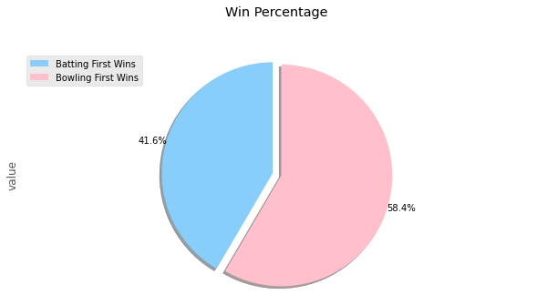

# IPL-Data-Analysis-2008-2019
Real time data analysis to get insightful results on team's performance 

## Dependencies

## Introduction

Data analytics is used in many sports for improving the overall team performance and maximizing winning chances. Real-time data analytics can help in gaining insights even during the game for changing tactics by the team and by associated businesses for economic benefits and growth.
Besides historical analysis, predictive models are harnessed to determine the possible match outcomes that require significant number crunching and data science know-how, visualization tools and capability to include newer observations in the analysis. In the [notebook](Notebook.ipynb), some data explored and analysed regarding IPL.

## Thanks for Reading :)
